# Programming Reference Guide 🐼💻

*"There is no secret ingredient to programming... except maybe lots of practice and Tim Tams!"* - Master Oogway (probably)


---

## Variables 📦🥡

**What are they?** A variable is like Po's **noodle bowl** 🍜 with a label on it! You can put different things in the bowl (like wontons or dumplings), and later you can find what's inside by reading the label on the bowl.

**Think** of your **Bunnings sausage sizzle plate** 🌭! Your plate has your name on it (that's the variable name), and on it you've got your snag, onions, and sauce (these are value). Just like how Po keeps his different foods in different bowls!

```python
pos_favourite_food = "dumplings"     # Po's bowl labeled "favourite_food" 
aussie_snack = "Tim Tams"            # Our bowl with Tim Tams inside
drop_bear_count = 42                 # A bowl with 42 imaginary drop bears
```

**Fun Fact:** Master Shifu says variables are like his students - they can change and grow! 🐼

---

## Strings 📝🎭

**What is it?** A string is any combination of **text or words** that the computer remembers, just like when Po shouts "SKADOOSH!" 💥 In Python, we put strings inside quotation marks so the computer knows it's text, not kung-fu moves.

**Think** of strings like **text messages** 📱 or what characters say in your favourite video games! Everything inside the quotation marks is exactly what they're saying, word for word - just like dialogue in Minecraft or Roblox! 🎮

```python
pos_catchphrase = "SKADOOSH!"
blueys_game = "Let's play keepy-uppy!"
aussie_greeting = "How ya goin', mate?"
drop_bear_warning = "They're not real... or are they? 🐨"
```

**Shifu's Wisdom:** "A string is like a dragon scroll - every character matters!" 🐲

---

## Numbers 🔢🥢

**What is it?** Numbers in programming work just like counting dumplings! You can add them, subtract them (when Po eats them), and use them to count how many times Tigress can punch in one second. 🥟

**Types of Numbers:**
- **Whole numbers** (integers): 1 meat pie, 2 Paddle Pops, 100 Weet-Bix
- **Decimal numbers** (floats): 1.5 litres of milk, 36.5°C on a hot day, $4.50 for a Freddo Frog

```python
pos_dumpling_count = 47              # Po ate 47 dumplings (again!)
melbourne_temperature = 4.2          # "Four seasons in one day", right?
servo_pie_price = 5.50               # Expensive but worth it!
drop_bear_danger_level = 9000.1      # Over 9000! (But they're not real... 😉)
```

**Cool Operations:**
```python
total_snags = 15 + 13              # Bunnings sausage count
fairy_bread_left = 20 - 8          # After the kids attacked it
footy_teams_in_nsw = 9 + 1         # NRL teams (Go the Blues!) 💙
```

**Viper's Tip:** "Strike fast with numbers, like a calculator cobra!" 🐍⚡

---

## Print 📢🐼


**What is it?** Print is like **Po shouting "SKADOOSH!" so loud that everyone in the Valley of Peace can hear him**! 💥 When you use `print()` in Python, you're telling the computer to shout something onto the screen so you (and everyone looking) can see it!

**Analogy:** Think of it like **the school PA system**! 📢 When the principal wants everyone to know something (like "The canteen has run out of chicken nuggets"), they use the speakers to announce it to the whole school. That's exactly what `print()` does - it announces your message to the computer screen!

**How Po uses it:**
```python
print("SKADOOSH!")                    # Po's favourite battle cry
print("I LOVE DUMPLINGS!")            # Po being Po
print("Master Shifu is only THIS tall!")  # Po getting in trouble
```

---

## Functions 🛠️🥋

**What is it?** A function is like **Master Shifu's training routine**! You give him a student (input), he does some kung-fu training magic on them, and out comes a much better fighter (output)! 

**Think** A function is like **the slushie machine at the servo**! 🥤 You press the blue raspberry button (input), the machine does its spinning and freezing magic (the function), and out comes that perfectly blue tongue-staining slushie (output)! Every time you press the same button, you get the same icy result!

```python
def train_like_po(student_name):
    return student_name + " is now a Kung Fu master! 🥋"

def make_fairy_bread(bread_slices):
    return "You made " + str(bread_slices) + " pieces of fairy bread! 🧚‍♀️🍞"

# Using our functions (like Po using kung-fu moves!)
result = train_like_po("Bandit")
print(result)  # This will show: Bandit is now a Kung Fu master! 🥋

snack_result = make_fairy_bread(12)
print(snack_result)  # This will show: You made 12 pieces of fairy bread! 🧚‍♀️🍞
```

**Master Oogway says:** "A function is like wisdom - you use it over and over again!" 🐢✨

---

## Loops 🔄🏃‍♂️


**What is it?** A loop makes the computer **repeat** the same thing over and over, just like when Po practices the same kung-fu move 1000 times, or when you have to do laps around the oval at school! 🏃‍♂️💨

**For Loop - Counting Like Po's Training:**

```python
# Po practicing his moves
for training_session in range(1, 6):
    print("Training session", training_session, "- HIIIIII-YA! 🥋")
```

**While Loop - Keep Going Until Full:**

```python
tim_tams_left = 10
while tim_tams_left > 0:
    print("Mmmm, I have", tim_tams_left, "Tim Tams left! 🍫")
    tim_tams_left = tim_tams_left - 1  # Nom nom nom
print("Packet's empty! Time to open another one! 😋")
```

**Think:** like **a command in Roblox**! You type "/dance" (input), the game processes it (function), and your avatar starts doing that cringey dance move (output)! Same command = same embarrassing result! 💃

**Crane's Wisdom:** "Patience, young coder. Even the mightiest loop started with one iteration!" 🕊️

---

## Dictionaries 📚🗂️


**Analogy:** Imagine **Po's character info card** from a video game! 🎮 Po has a **unique name (the key)**, and next to his name is all his **stats and info (the value)**, like his favourite food, his kung-fu level, and how many dumplings he can eat in one sitting. A dictionary works exactly like that character card!

```mermaid
graph TD
    A("Po's Character Card 🐼") --> B{"Key"};
    A --> D{"Value"};
    B --> H["name"];
    D --> I["Po the Panda"];
    B --> C["home"];
    D --> E["Valley of Peace"];
    B --> F["dumpling_capacity"];
    D --> G["unlimited 🥟"];
    B --> J["catchphrase"];
    D --> K["SKADOOSH! 💥"];
```



We say: the "Key" "name" points to the "Value" "Po the Panda"

```python
pos_info = {
    "name": "Po the Panda",
    "home": "Valley of Peace", 
    "dumpling_capacity": "unlimited",
    "catchphrase": "SKADOOSH!",
    "favourite_aussie_food": "Meat pies (with soy sauce) 🥧"
}
```

**How to use it (like looking up Po's stats):**

```python
print(pos_info["name"])           # Shows: Po the Panda
print(pos_info["catchphrase"])    # Shows: SKADOOSH!
```

**Mantis says:** "Small keys open big values, just like small bugs can be mighty warriors!" 🦗💪

---

## Nested Data Structures 📦📦🎁


**Analogy:** Think of **Chinese takeaway containers**! 🥡 You get the big container, but inside there's another container with spring rolls, and inside THAT container might be individual sauce packets! A nested dictionary is like those containers - dictionaries inside dictionaries, keeping everything organised just like how Mr. Ping organises his noodle shop!

```mermaid
graph TD
    A[Kung Fu Adventure Game 🥋] --> B{"The Jade Palace"};
    B --> C{"Value: Dictionary"};
    C --> D{"Key: Description"};
    D --> E["You're at the Jade Palace training ground..."];
    C --> F{"Key: Choices"};
    F --> G{"Value: Dictionary"};
    G --> H{"Key: 1"};
    H --> I["Train with Po 🐼"];
    G --> J{"Key: 2"};
    J --> K["Eat dumplings 🥟"];
    G --> L{"Key: 3"};
    L --> M["Practice on the training dummy 🎯"];
```



```python
jade_palace_adventure = {
    "jade_palace": {
        "description": "You're at the Jade Palace! Po is here eating dumplings. What do you want to do?",
        "choices": {
            "1": "Train with Po (warning: lots of falling down!) 🐼",
            "2": "Join the dumpling eating contest 🥟",
            "3": "Try to understand Master Oogway's riddles 🐢"
        },
        "special_items": ["Dragon Scroll", "Wuxi Finger Hold manual", "Emergency Tim Tams"]
    }
}
```

**Master Oogway's wisdom:** "Like the layers of an onion, data structures reveal their secrets one level at a time... but hopefully less tears!" 🐢😂

---

## Lists of Dictionaries 📋🎪

**Analogy:** Imagine you're looking at the **Royal Melbourne Show showbag list**! 🎪 The list shows all the different showbags you can buy. But for each showbag, there's heaps of info - the name, what's inside, the price, and how much fairy floss you'll need to eat to feel better about spending your pocket money! A list of dictionaries is exactly like that showbag list!

```mermaid
graph TD
    A[List of Kung Fu Locations 🗺️] --> B(Dictionary 1 🐼);
    A --> C(Dictionary 2 🏔️);  
    A --> D(Dictionary 3 🏖️);
    B --> B1["'name': 'Jade Palace'"];
    B --> B2["'vibe': 'Kung Fu training'"];
    C --> C1["'name': 'Snowy Mountains'"];
    C --> C2["'vibe': 'Skiing & hot chocolate'"];
    D --> D1["'name': 'Bondi Beach'"];
    D --> D2["'vibe': 'Surfing & sunscreen'"];
```



```python
adventure_locations = [
    {
        "name": "The Jade Palace",
        "state": "Mystical Valley (probably NSW)",
        "description": "Where Po trains and eats dumplings",
        "danger_level": "Medium (mainly from Po falling on you)",
        "local_food": "Dumplings and noodles 🥟🍜"
    },
    {
        "name": "Uluru", 
        "state": "Northern Territory",
        "description": "Big red rock in the middle of nowhere",
        "danger_level": "Low (unless you forget your hat)",
        "local_food": "Bush tucker and Violet Crumbles 🍫"
    },
    {
        "name": "Luna Park Melbourne",
        "state": "Victoria", 
        "description": "Scary clown face that haunts your dreams",
        "danger_level": "High (that face though! 😱)",
        "local_food": "Fairy floss and regret 🍭"
    }
]
```

**Tigress reminds us:** "A warrior must know all locations, from the highest mountain to the deepest Bunnings warehouse!" 🐅🔨

---

## How the Game Flows 🗺️🎢

**Analogy:** Think of the game like **Po's epic adventure across Australia**! 🇦🇺🐼 He starts in Sydney (probably confused about where all the dumplings are), and when you make choices, Po waddles to different places based on what you pick. Maybe he goes to Melbourne for a coffee that's too fancy, or Queensland to find out that drop bears aren't real (or ARE they? 🐨). The **flow** is how Po bounces around Australia like a kung-fu kangaroo!

```mermaid
graph TD
    A[Po arrives in Sydney 🏙️] --> B{Go north to find more dumplings or south for coffee?};
    B -- "North for dumplings! 🥟" --> C[Brisbane: 'These prawns aren't dumplings!' 🦐];
    B -- "South for coffee! ☕" --> D[Melbourne: 'This coffee costs HOW much?!' 💸];
    C --> E{Hit up the Gold Coast or visit the outback?};
    D --> F{Watch AFL or get lost in laneways?};
    E --> G[Gold Coast: 'Why is everything so shiny?' ✨];
    F --> H[MCG: 'This is like kung fu but with a ball!' 🏈];
```



**In Code (Po's Adventure Simulator):**
```python
def pos_aussie_adventure():
    current_location = "Sydney"
    confusion_level = "Maximum"
    
    print("Po has landed in Australia! He's very confused! 🐼✈️")
    
    while confusion_level == "Maximum":
        if current_location == "Sydney":
            print("Po: 'Where are all the dumplings? And what's a flat white?' ☕❓")
            choice = input("Go north for adventure or south for fancy coffee? ")
            
            if choice == "north":
                current_location = "Brisbane"
                print("Po: 'It's so hot! And why do they call prawns 'prawns'?' 🦐🔥")
            elif choice == "south":
                current_location = "Melbourne"
                print("Po: 'Four seasons in one day? That's more confusing than Master Oogway!' 🌦️")
        
        # Po's adventure continues with maximum chaos! 🎪
```

**Final wisdom from Master Shifu:** "Code flows like water, young grasshopper... but hopefully with fewer bugs than a Queensland summer!" 🦗💧

---

## Quick Reference - Python Basics 🐍📖

**Printing to Screen (Like Po shouting):**
```python
print("SKADOOSH! 💥")
print("I love Tim Tams almost as much as dumplings! 🍫🥟")
```

**Getting Input from User (Like asking for dumpling orders):**
```python
name = input("What's your name, future kung fu master? ")
favourite_snack = input("Tim Tams or Lamingtons? ")
```

**If Statements (Making choices like Po):**
```python
if age >= 10:
    print("You're old enough to understand why Vegemite is amazing! 🍞")
else:
    print("Give it a few years, young padawan! 🥄")
```

**Comments (Secret notes, like Po's training diary):**
```python
# This is a comment - Po uses these to remember his training tips
age = 9  # Po's student age (not Po's actual age - that's classified! 🤫)
# Remember: Always practice your SKADOOSH before bedtime! 💤
```

**Po's Final Message:** "Remember, there is no secret ingredient to coding... except maybe practicing every day and having plenty of snacks! Now go forth and code like the Dragon Warrior! 🐼🐲💻"

---

*"The coding journey of a thousand programs begins with a single 'Hello World!' ...and probably ends with debugging why your kangaroo sprite is