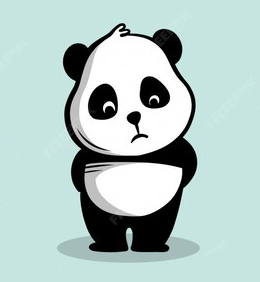
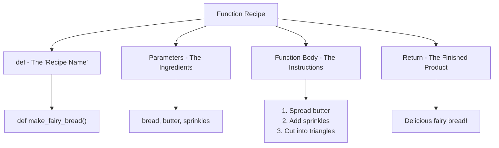

# Functions Guide

*"A function is like Po's secret kung-fu move - you learn it once, then use it whenever you need to kick butt!"* - Master Shifu (definitely)


---

## What Are Functions?

**What is it?** A function is like **Po's special kung-fu technique**! You teach Po a move once (like the Wuxi Finger Hold), give it a cool name, and then whenever trouble comes up, Po can use that same move again and again! Functions in Python work exactly the same way - you create them once, then use them whenever you need them!

**Think** of functions like **your favourite footy team's plays**! The coach teaches the team a special play (like "The Melbourne Miracle"), and every time they need that play, they just call out its name and everyone knows exactly what to do! Same input (calling the play) = same awesome result (hopefully)!

```python
def pos_signature_move():
    print("SKADOOSH!")
    print("Belly bounce attack activated!")
    return "Victory achieved through the power of dumplings!"

# Using Po's move (calling the function)
result = pos_signature_move()
print(result)
```

**Master Oogway says:** "Yesterday is history, tomorrow is a mystery, but a well-written function works today, tomorrow, and next Tuesday!"

---

## Function Parts - The Recipe

**Analogy:** Think of a function like **Nanna's secret lamington recipe**! She has the ingredients list (parameters), the step-by-step instructions (the function body), and at the end you get delicious lamingtons (the return value)!



**The Function Blueprint:**
```python
def function_name(ingredients_go_here):
    # Instructions go here (like Nanna's secret steps!)
    # Do some cooking magic (
    return "The delicious result!"
```

---

## Functions Without Parameters - Po's Solo Moves


**What is it?** Sometimes Po doesn't need any help to do his thing! These functions are like **Po's morning routine** - he just does it, no questions asked, same way every time!

**Analogy:** Like **pressing the "start" button on the coffee machine at Maccas**!  You don't need to tell it anything - it just knows what to do and makes that perfect flat white (or tries to, anyway)!

```python
def pos_morning_routine():
    print("Po wakes up and stretches")
    print("Immediately thinks about dumplings")
    print("Attempts meditation (falls asleep)")
    print("Practices kung-fu moves")
    return "Po is ready for the day!"

def play_aussie_anthem():
    print("Down Under by Men at Work starts playing!")
    print("Invisible kangaroos start hopping!")
    print("Vegemite sandwiches appear out of nowhere!")
    return "You're now 47% more Australian!"

# Using these functions
pos_morning_routine()
play_aussie_anthem()
```

**Crane's Wisdom:** "Some moves require no preparation, young warrior. Like my graceful flight... or finding a parking spot at Westfield on Saturday!"

---

## Functions With Parameters - Team Moves


**What is it?** Sometimes Po needs help from his friends! These functions take **information** (called parameters) to work properly, just like how Po needs to know WHO he's fighting to pick the right kung-fu move!

**Analogy:** Think of **ordering at Hungry Jack's**! The worker needs to know WHAT you want (Big Mac... wait, wrong place!), what SIZE, and if you want it WITH or WITHOUT pickles. They can't make your order without this info!

```python
def train_kung_fu_student(student_name, skill_level):
    if skill_level == "beginner":
        training = "Basic noodle-slurping technique"
    elif skill_level == "intermediate":
        training = "Advanced dumpling-catching moves"
    else:
        training = "Master-level belly-bounce combat!"

    return f"{student_name} learned: {training}"

def make_bunnings_snag(sauce_choice, onion_choice):
    snag = "<- One delicious sausage"

    if sauce_choice == "tomato":
        snag = snag + " + tomato sauce (the classic!)"
    elif sauce_choice == "mustard":
        snag = snag + " + mustard (fancy!)"
    else:
        snag = snag + " + no sauce (are you okay, mate?)"

    if onion_choice == "yes":
        snag = snag + " + grilled onions (perfection!)"

    return snag + " = Pure Bunnings magic!"

# Using functions with parameters
result1 = train_kung_fu_student("Bluey", "beginner")
print(result1)

result2 = make_bunnings_snag("tomato", "yes")
print(result2)
```

**Viper's Tip:** "The right information at the right time makes all the difference, like knowing which servo has the cheapest petrol!"

---

## Return Values - Bringing Home the Goods


**What is it?** Return is like **Po coming home after a successful dumpling quest** He went out (the function ran), did his thing (the function body), and now he's bringing back the goods (the return value)!

**Analogy:** Like **going to Woolies for your mum** She sends you with a shopping list (parameters), you do the shopping (function body), and you come home with the groceries (return value). If you forget to bring anything back, mum's not happy!

```python
def calculate_tim_tam_sharing(total_tim_tams, number_of_mates):
    # The sacred Tim Tam mathematics!
    tim_tams_each = total_tim_tams // number_of_mates
    leftover_tim_tams = total_tim_tams % number_of_mates

    # Return multiple things (like bringing back milk AND bread!)
    return tim_tams_each, leftover_tim_tams

def pos_dumpling_rating(dumpling_type):
    if dumpling_type == "pork":
        return "11/10 - Po's favourite!"
    elif dumpling_type == "vegetable":
        return "8/10 - Healthy but missing something..."
    elif dumpling_type == "chocolate":
        return "IMPOSSIBLE/10 - This isn't a thing... yet!"
    else:
        return "7/10 - Po will eat anything dumpling-shaped!"

# Using return values (catching what comes back!)
each, leftover = calculate_tim_tam_sharing(20, 3)
print(f"Each mate gets {each} Tim Tams, with {leftover} left to fight over!")

rating = pos_dumpling_rating("pork")
print(f"Po says: {rating}")
```

**Important:** If you don't use `return`, your function is like going to the shops and forgetting to come home! The function does stuff but gives you back `None` (which is Python's way of saying "nothing to see here, mate!")

**Mantis says:** "Even the smallest return value can carry the weight of great responsibility... like remembering to bring back the change!"

---

## Function Scope - Po's Personal Space

**What is it?** Function scope is like **Po's bedroom at the Jade Palace**! What happens in Po's room stays in Po's room - his dirty socks, his secret dumpling stash, his embarrassing diary entries about kung-fu moves. Other people can't see or touch Po's personal stuff unless he specifically shows them!

**Analogy:** Think of your **bedroom vs the family lounge room**! Your bedroom stuff is YOURS (local variables), but everyone can use the stuff in the lounge room like the TV or the good biscuits (global variables). You can see the lounge room stuff from your bedroom, but your little sister can't get into your bedroom to steal your lollies!

```python
# Global variable - like the family TV (everyone can see it!)
favourite_aussie_animal = "Quokka"

def pos_secret_training():
    # Local variable - like Po's secret diary (only Po can see it!)
    secret_technique = "Triple Somersault Belly Flop"
    embarrassing_fear = "Butterflies (they're too pretty!)"

    # Po can see both his secret stuff AND the global stuff
    print(f"Po's secret move: {secret_technique}")
    print(f"But everyone knows his favourite animal: {favourite_aussie_animal}")

    return "Training complete (shh, don't tell Shifu!)"

def try_to_find_pos_secrets():
    # This won't work! Can't see Po's bedroom secrets from outside!
    # print(secret_technique)  # This would cause an error!

    # But we can still see the global stuff
    print(f"We all know Po likes: {favourite_aussie_animal}")

# Using the functions
pos_secret_training()
try_to_find_pos_secrets()
```

**Master Shifu's Warning:** "Young grasshopper, respect the boundaries of variables, like respecting your mate's Spotify playlist!"

---

## Multiple Parameters - The More The Merrier!

**What is it?** Sometimes you need LOTS of information to get the job done, like when **Po organises a massive dumpling feast** and needs to know everyone's favourite flavour, how hungry they are, and if anyone's allergic to anything!

**Analogy:** Like **planning the perfect Aussie BBQ**! You need to know how many people are coming, what meat they want, who's bringing the potato salad, if anyone's vegetarian, and most importantly - who's responsible for not burning the snags!

```python
def plan_aussie_bbq(num_people, meat_choice, salad_bringer, weather, music_preference):
    bbq_plan = f"BBQ Plan for {num_people} legends:\n"
    bbq_plan += f"Main event: {meat_choice}\n"
    bbq_plan += f"{salad_bringer} is bringing the salads (cheers mate!)\n"

    if weather == "sunny":
        bbq_plan += " Perfect weather - set up in the backyard!\n"
    elif weather == "rainy":
        bbq_plan += "Rainy day - BBQ under the carport!\n"
    else:
        bbq_plan += "Unpredictable weather - this is Australia, mate!\n"

    bbq_plan += f"Soundtrack: {music_preference} (and probably some Acca Dacca)\n"
    bbq_plan += "Don't forget the Bundy and Coke for the adults!"

    return bbq_plan

def pos_mega_dumpling_order(pork_count, chicken_count, veggie_count, spice_level, urgency):
    total_dumplings = pork_count + chicken_count + veggie_count

    order = f" Po's Mega Order: {total_dumplings} dumplings!\n"
    order += f"   - {pork_count} pork (Po's fave!)\n"
    order += f"   - {chicken_count} chicken (for variety)\n"
    order += f"   - {veggie_count} veggie (to pretend he's healthy)\n"

    if spice_level == "mild":
        order += "🔥Spice level: Mild (Po's tongue is sensitive!)\n"
    elif spice_level == "medium":
        order += "🔥🔥Spice level: Medium (Po's feeling brave!)\n"
    else:
        order += "🔥🔥🔥Spice level: HOT (Po will regret this!)\n"

    if urgency == "now":
        order += " RUSH ORDER: Po is HANGRY!"
    else:
        order += "=P Regular timing (Po can wait... barely)"

    return order

# Using functions with lots of parameters
bbq_details = plan_aussie_bbq(15, "Mixed grill", "Sarah", "sunny", "Triple J Hottest 100")
print(bbq_details)

dumpling_order = pos_mega_dumpling_order(20, 10, 5, "medium", "now")
print(dumpling_order)
```

**Tigress reminds us:** "Organization is key to victory, whether in battle or in making sure everyone gets fed at the barbie!"

---

## Function Documentation - Writing Good Notes

**What is it?** Function documentation is like **leaving notes for your future self** (or your mates) about what your function does! It's like Po leaving instructions on his bedroom door: "Dumpling stash behind the scroll cabinet - please don't tell Shifu!"

**Analogy:** Think of it like **instructions on a meat pie box**! The box tells you what's inside, how to cook it, how long to microwave it, and warns you that the contents will be "hotter than the surface of the sun" afterwards!

```python
def calculate_footy_ladder_points(wins, draws, losses):
    """
    Calculate total AFL ladder points for a team.

    In AFL, teams get:
    - 4 points for a win <
    - 2 points for a draw >
    - 0 points for a loss =-

    Parameters:
    - wins: number of games won (int)
    - draws: number of games drawn (int)
    - losses: number of games lost (int)

    Returns:
    - total_points: total ladder points (int)

    Example:
    >>> calculate_footy_ladder_points(12, 2, 8)
    52
    """
    total_points = (wins * 4) + (draws * 2) + (losses * 0)
    return total_points

def pos_cooking_adventure(ingredient, cooking_method, confidence_level):
    """
    Simulate Po attempting to cook something (results may vary!).

    Po's cooking skills are... questionable. This function predicts
    the likely outcome when Po tries to cook anything more complex
    than instant noodles.

    Parameters:
    - ingredient: what Po is trying to cook (string)
    - cooking_method: how Po plans to cook it (string)
    - confidence_level: how confident Po is (1-10, int)

    Returns:
    - result: description of what probably happened (string)

    Warning: Do not actually let Po cook unsupervised! =%
    """
    if confidence_level > 8:
        outcome = "Overconfident disaster - kitchen on fire! =%"
    elif confidence_level > 5:
        outcome = "Edible, but looks weird - classic Po! ="
    else:
        outcome = "Somehow accidentally created something amazing! ("

    return f"Po tried to {cooking_method} {ingredient}. Result: {outcome}"
```

**Master Oogway's wisdom:** "Clear documentation is like a map through the desert - it guides others safely to the oasis of understanding!"

---

## Common Function Mistakes - Learning From Po's Oops! 

**What is it?** Even Po makes mistakes when learning kung-fu! Here are the most common function whoopsies that happen to everyone (yes, even Master Shifu probably made these mistakes once)!

### Mistake 1: Forgetting to Return

```python
# WRONG - Po does all this work but brings nothing home!
def calculate_dumpling_cost(num_dumplings):
    cost = num_dumplings * 2.50
    # Oops! Po forgot to return the cost!

# RIGHT - Po remembers to bring the answer back!
def calculate_dumpling_cost(num_dumplings):
    cost = num_dumplings * 2.50
    return cost  # Don't forget this bit!
```

### Mistake 2: Using Variables Outside Their Scope

```python
# WRONG - Trying to use Po's bedroom secrets in the kitchen!
def pos_secret_training():
    secret_move = "Invisible Noodle Technique"

def show_secret():
    print(secret_move)  # ERROR! Can't see Po's bedroom secrets!

# RIGHT - Either make it global or pass it around properly!
def pos_secret_training():
    secret_move = "Invisible Noodle Technique"
    return secret_move  # Po shares his secret!

def show_secret():
    move = pos_secret_training()  # Now we can see it!
    print(move)
```

### Mistake 3: Not Handling All Cases

```python
# WRONG - What if someone orders something weird?
def rate_aussie_food(food):
    if food == "meat pie":
        return "10/10 - Legend status!"
    elif food == "tim tams":
        return "11/10 - Perfect!"
    # But what about Vegemite? Or kangaroo steaks?

# RIGHT - Always have a backup plan!
def rate_aussie_food(food):
    if food == "meat pie":
        return "10/10 - Legend status!"
    elif food == "tim tams":
        return "11/10 - Perfect!"
    elif food == "vegemite":
        return "Love it or hate it - no in between!"
    else:
        return "Haven't tried it yet, but if it's Aussie, it's probably great!"
```

**Mantis says:** "Making mistakes is how we learn, like the time I tried to high-five Master Shifu... with my face!"

---

## Advanced Function Fun - Level Up!

### Default Parameters - The Backup Plan

**What is it?** Default parameters are like **having a spare Tim Tam packet hidden in your backpack**! If something goes wrong with the main plan, you've got a backup ready to go!

```python
def order_coffee(size="regular", milk_type="full cream", sugar_level=1):
    """
    Order coffee with sensible Aussie defaults!
    If you don't specify, you get the 'standard cafe order'.
    """
    coffee = f"One {size} coffee with {milk_type} milk"

    if sugar_level == 0:
        coffee += ", no sugar (health kick?)"
    elif sugar_level == 1:
        coffee += ", one sugar (standard)"
    else:
        coffee += f", {sugar_level} sugars (sweet tooth!)"

    return coffee + " "

# Using defaults - lazy but effective!
print(order_coffee())  # Uses all the defaults
print(order_coffee("large"))  # Just changes size
print(order_coffee("small", "oat", 0))  # Hipster coffee!
```

### Functions Calling Other Functions - Teamwork!

```python
def calculate_pizza_slices_per_person(people, pizzas):
    """Work out if there's enough pizza for everyone."""
    total_slices = pizzas * 8  # Most pizzas have 8 slices
    slices_per_person = total_slices / people
    return slices_per_person

def plan_pizza_party(people):
    """Plan the perfect pizza party using our slice calculator!"""
    pizzas_needed = people // 3  # Rough guide: 1 pizza per 3 people

    slices_each = calculate_pizza_slices_per_person(people, pizzas_needed)

    if slices_each < 2:
        return f"Order more pizzas! Only {slices_each:.1f} slices each - that's not enough!"
    elif slices_each > 4:
        return f"Pizza overload! {slices_each:.1f} slices each - prepare for food comas!"
    else:
        return f"Perfect! {slices_each:.1f} slices per person - just right!"
"

# Functions working together like the Furious Five!
result = plan_pizza_party(12)
print(result)
```

**Shifu's Advanced Teaching:** "When functions work together harmoniously, they create something greater than the sum of their parts... like a perfectly coordinated dumpling assembly line!"

---

## Quick Reference - Function Cheat Sheet

```python
# Basic Function (No parameters)
def say_gday():
    print("G'day mate!")
    return "Greeting complete!"

# Function with Parameters
def make_lamington(size, coconut_amount):
    return f"One {size} lamington with {coconut_amount} coconut!"

# Function with Default Parameters
def brew_tea(tea_type="English Breakfast", strength="medium", milk=True):
    tea = f"{strength} {tea_type} tea"
    if milk:
        tea += " with milk"
    return tea + " "

# Function with Multiple Returns
def footy_score_analysis(home_score, away_score):
    difference = abs(home_score - away_score)

    if home_score > away_score:
        winner = "Home team"
    elif away_score > home_score:
        winner = "Away team"
    else:
        winner = "It's a draw!"

    return winner, difference

# Using Functions
say_gday()
snack = make_lamington("large", "heaps")
drink = brew_tea()
winner, margin = footy_score_analysis(98, 76)
```

**Po's Final Wisdom:** "Remember, functions are like kung-fu moves - practice them, master them, and soon you'll be coding like the Dragon Warrior! And always remember to return your values, just like returning your library books... but more fun!"

---

*"The function journey of a thousand programs begins with a single def... and probably ends with figuring out why your function is returning None instead of Tim Tams!"*

**Master Oogway's Last Word:** "There are no accidents in coding... only happy little bugs waiting to become features!"
