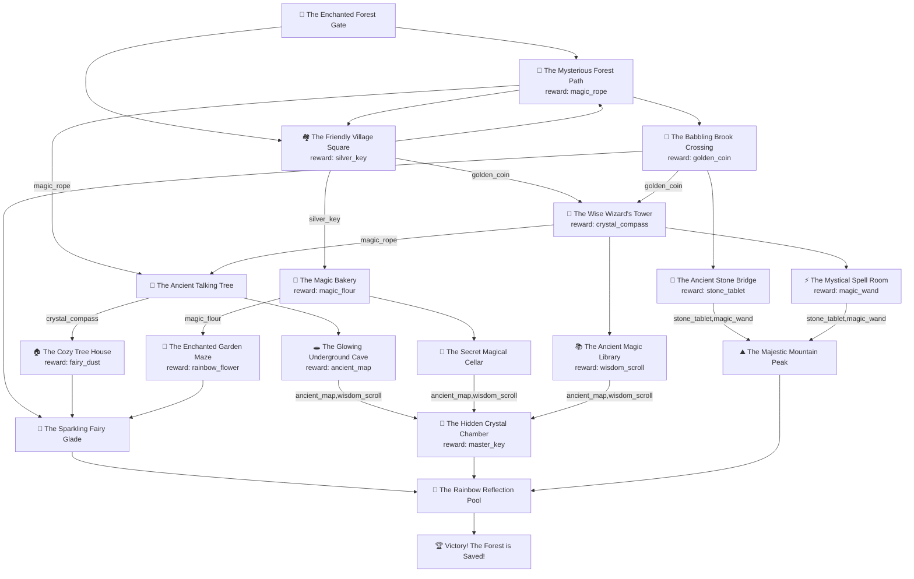

# Session 4 - Reading Files and Data Structures Bringing it all together

## Overview

This module teaches students how to **read and process data from external files** using Python's `configparser` library. Students learn to create data-driven applications by separating game logic from content, making programs more flexible and maintainable.

## Program Flow and Architecture

### Main Data Loading Process

```
PROGRAM STARTUP
   |
   v
┌─────────────────────────────────────────────────────────────────┐
│ main() Execution Flow                                           │
│                                                                 │
│  Step 1: Load Game Structure                                   │
│  ┌─────────────────────────────────────────────────────────┐   │
│  │ load_graph_from_ini('data.ini')                        │   │
│  │  ├─ Create ConfigParser instance                       │   │
│  │  ├─ Read data.ini file                                │   │
│  │  ├─ Parse each [section] as game location             │   │
│  │  └─ Return dictionary of location data                │   │
│  └─────────────────────────────────────────────────────────┘   │
│                                                                 │
│  Step 2: Load Story Content                                    │
│  ┌─────────────────────────────────────────────────────────┐   │
│  │ load_stories('stories.ini')                            │   │
│  │  ├─ Create ConfigParser instance                       │   │
│  │  ├─ Read stories.ini file                             │   │
│  │  ├─ Parse each [section] as story content             │   │
│  │  └─ Return dictionary of story data                   │   │
│  └─────────────────────────────────────────────────────────┘   │
│                                                                 │
│  Step 3: Display Loaded Data                                   │
│  ┌─────────────────────────────────────────────────────────┐   │
│  │ Print Adventure Game Graph                              │   │
│  │  ├─ Iterate through each location                      │   │
│  │  ├─ Display title, requirements, connections           │   │
│  │  └─ Show item rewards                                  │   │
│  └─────────────────────────────────────────────────────────┘   │
│                                                                 │
│  Step 4: Display Story Content                                 │
│  ┌─────────────────────────────────────────────────────────┐   │
│  │ Print Stories                                           │   │
│  │  ├─ Iterate through each story                         │   │
│  │  └─ Display full story text                           │   │
│  └─────────────────────────────────────────────────────────┘   │
└─────────────────────────────────────────────────────────────────┘
```

### ConfigParser Data Processing Flow

```
load_graph_from_ini('data.ini')
   |
   v
┌─────────────────────────────────────────────────────────────────┐
│ File Reading and Parsing Process                               │
│                                                                 │
│  ┌─────────────────────────────────────────────────────────┐   │
│  │ ConfigParser.read('data.ini')                          │   │
│  │  ├─ Open data.ini file                                 │   │
│  │  ├─ Parse INI format sections and keys                 │   │
│  │  └─ Store in ConfigParser internal structure           │   │
│  └─────────────────────────────────────────────────────────┘   │
│                                                                 │
│  ┌─────────────────────────────────────────────────────────┐   │
│  │ For each [section] in data.ini:                        │   │
│  │                                                         │   │
│  │  Extract Section Data:                                  │   │
│  │  ├─ story_key = section name                           │   │
│  │  ├─ title = config.get(section, 'title')               │   │
│  │  ├─ requires_items = split by comma                    │   │
│  │  ├─ connections = split by comma                       │   │
│  │  └─ item_reward = get value or None                    │   │
│  │                                                         │   │
│  │  Process Lists:                                         │   │
│  │  ├─ Split comma-separated strings                      │   │
│  │  ├─ Strip whitespace from each item                    │   │
│  │  └─ Filter out empty strings                           │   │
│  │                                                         │   │
│  │  Store in Dictionary:                                   │   │
│  │  └─ data[section] = single_node_data                   │   │
│  └─────────────────────────────────────────────────────────┘   │
│                                                                 │
│  Return: Complete graph dictionary                              │
└─────────────────────────────────────────────────────────────────┘
```

## Data Structure Organization

### INI File Format Structure

```
data.ini File Structure              stories.ini File Structure
┌─────────────────────────────┐      ┌──────────────────────────────┐
│ [start]                     │      │ [start]                      │
│ title = 🌲 Forest Gate      │      │ story = You step through...  │
│ requires_items =            │      │                              │
│ connections = forest,village│      │ [forest_path]                │
│ item_reward = None          │      │ story = You enter the...     │
│                             │      │                              │
│ [forest_path]              │      │ [village_square]             │
│ title = 🌿 Forest Path     │      │ story = You arrive at...     │
│ requires_items =            │      │                              │
│ connections = tree,stream   │      │ ... (story content for       │
│ item_reward = magic_rope    │      │      all locations)          │
│                             │      │                              │
│ ... (all game locations)   │      └──────────────────────────────┘
└─────────────────────────────┘
```

### Python Dictionary Structure After Loading

```
Loaded Graph Dictionary Structure:
┌─────────────────────────────────────────────────────────────────┐
│ graph = {                                                       │
│   'start': {                                                    │
│     'story_key': 'start',                                       │
│     'title': '🌲 The Enchanted Forest Gate',                   │
│     'requires_items': [],                                       │
│     'connections': ['forest_path', 'village_square'],           │
│     'item_reward': None                                         │
│   },                                                            │
│   'forest_path': {                                              │
│     'story_key': 'forest_path',                                │
│     'title': '🌿 The Mysterious Forest Path',                  │
│     'requires_items': [],                                       │
│     'connections': ['old_tree', 'stream_crossing', 'village_square'], │
│     'item_reward': 'magic_rope'                                 │
│   },                                                            │
│   ... (all other locations)                                    │
│ }                                                               │
└─────────────────────────────────────────────────────────────────┘

Loaded Stories Dictionary Structure:
┌─────────────────────────────────────────────────────────────────┐
│ stories = {                                                     │
│   'start': {                                                    │
│     'story': 'You step through the ancient Enchanted...'       │
│   },                                                            │
│   'forest_path': {                                              │
│     'story': 'You step into the mysterious forest path...'     │
│   },                                                            │
│   ... (all other stories)                                      │
│ }                                                               │
└─────────────────────────────────────────────────────────────────┘
```

## Advanced Tools and Utilities

### Story Generation Tool (write-file.py)

```
write-file.py Execution Flow
   |
   v
┌─────────────────────────────────────────────────────────────────┐
│ AI-Powered Story Generation Process                             │
│                                                                 │
│  Step 1: Load Game Structure                                   │
│  ┌─────────────────────────────────────────────────────────┐   │
│  │ graph = load_graph_from_ini()                          │   │
│  └─────────────────────────────────────────────────────────┘   │
│                                                                 │
│  Step 2: Generate Stories for Each Location                    │
│  ┌─────────────────────────────────────────────────────────┐   │
│  │ For each node_id, node_data in graph.items():          │   │
│  │                                                         │   │
│  │  ┌─────────────────────────────────────────────────┐   │   │
│  │  │ get_story_content()                             │   │   │
│  │  │  ├─ Build AI prompt with location details       │   │   │
│  │  │  ├─ Include next location choices               │   │   │
│  │  │  ├─ Call Ollama API for story generation        │   │   │
│  │  │  └─ Return generated story text                 │   │   │
│  │  └─────────────────────────────────────────────────┘   │   │
│  │                                                         │   │
│  │  ┌─────────────────────────────────────────────────┐   │   │
│  │  │ save_to_ini()                                   │   │   │
│  │  │  ├─ Load existing stories.ini file              │   │   │
│  │  │  ├─ Add new story section                       │   │   │
│  │  │  └─ Write updated file back to disk             │   │   │
│  │  └─────────────────────────────────────────────────┘   │   │
│  └─────────────────────────────────────────────────────────┘   │
└─────────────────────────────────────────────────────────────────┘
```

### Data Validation Tool (path-finder.py)

```
path-finder.py Analysis Process
   |
   v
┌─────────────────────────────────────────────────────────────────┐
│ Game Structure Analysis and Validation                         │
│                                                                 │
│  Step 1: Load and Analyze Graph Structure                      │
│  ┌─────────────────────────────────────────────────────────┐   │
│  │ analyze_graph()                                         │   │
│  │  ├─ Find all items in the game                         │   │
│  │  ├─ Map item sources (where items are found)           │   │
│  │  ├─ Map item requirements (where items are needed)     │   │
│  │  └─ Check for impossible item dependencies             │   │
│  └─────────────────────────────────────────────────────────┘   │
│                                                                 │
│  Step 2: Find All Valid Paths                                  │
│  ┌─────────────────────────────────────────────────────────┐   │
│  │ find_all_paths()                                        │   │
│  │  ├─ Use depth-first search with inventory tracking     │   │
│  │  ├─ Check item requirements for each location          │   │
│  │  ├─ Collect item rewards along the way                 │   │
│  │  └─ Record successful and blocked paths                │   │
│  └─────────────────────────────────────────────────────────┘   │
│                                                                 │
│  Step 3: Generate Detailed Reports                             │
│  ┌─────────────────────────────────────────────────────────┐   │
│  │ ✅ Successful paths to victory                          │   │
│  │ ❌ Blocked paths and why they failed                   │   │
│  │ 📊 Path statistics and game balance analysis           │   │
│  │ ⚠️ Validation warnings and recommendations             │   │
│  └─────────────────────────────────────────────────────────┘   │
└─────────────────────────────────────────────────────────────────┘
```

## File Processing Workflow

### Complete Data Pipeline

```
┌─────────────────┐    ┌─────────────────┐    ┌─────────────────┐
│   data.ini      │───▶│  ConfigParser   │───▶│ Python Dict     │
│ (Game Structure)│    │   Processing    │    │ (Graph Data)    │
└─────────────────┘    └─────────────────┘    └─────────────────┘
                                                      │
                                                      ▼
┌─────────────────┐    ┌─────────────────┐    ┌─────────────────┐
│  stories.ini    │───▶│  ConfigParser   │───▶│ Python Dict     │
│ (Story Content) │    │   Processing    │    │ (Story Data)    │
└─────────────────┘    └─────────────────┘    └─────────────────┘
                                                      │
                                                      ▼
┌─────────────────────────────────────────────────────────────────┐
│                    Game Application                             │
│  ┌─────────────────┐  ┌─────────────────┐  ┌─────────────────┐ │
│  │   Data Display  │  │ Story Generation│  │ Path Validation │ │
│  │   (main.py)     │  │ (write-file.py) │  │ (path-finder.py)│ │
│  └─────────────────┘  └─────────────────┘  └─────────────────┘ │
└─────────────────────────────────────────────────────────────────┘
```

## Learning Progression

This module establishes the foundation for data-driven programming:

1. **File Reading**: Students learn to read external configuration files
2. **Data Parsing**: Converting text-based data into Python structures
3. **Data Organization**: Using dictionaries and lists effectively
4. **Program Architecture**: Separating data from code logic
5. **Tool Development**: Creating utilities to analyze and validate data
6. **Content Generation**: Using AI to create new content and save it back to files

## Story Map

```
                    🌲 Start
                   /         \
                  /           \
            🌿 Forest      🏘️ Village
           (magic_rope)   (silver_key)
              /  |  \         /    \
             /   |   \       /      \
        🌳 Tree  | 🌊 Brook 🥖 Bakery 🏰 Wizard
     (need rope) |         (need key) (need coin)
        /    \   |           /    \     /   |   \
   🏠 House   🕳️ Cave   🍷 Cellar 🌹 Maze   🧚 Glade
   (need     (ancient   (ancient  (need    (fairy
   compass)   map)      map,wisdom flour)   dust)
                         scroll)
                           |
                       💎 Crystal Chamber
                      (need map+scroll)
                           |
                       🌈 Rainbow Pool
                           |
                       🏆 VICTORY!
```




Items unlock new areas, creating a puzzle-like progression that teaches logical thinking and planning while demonstrating the power of data-driven program design.