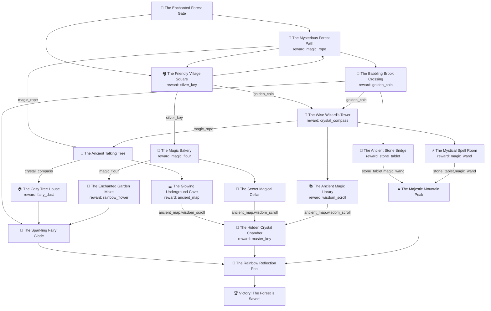

# Session 5 - AI-Powered Choose Your Own Adventure

## Overview

This module demonstrates how to integrate AI services (Ollama) into Python applications with robust fallback mechanisms. The game creates dynamic, personalized stories for children while ensuring reliability through backup content.

## Program Flow and Architecture

### Main Game Loop Flow

```
STARTUP
   |
   v
┌─────────────────────────────────────────────────────────────────┐
│ main()                                                          │
│  ├─ Load configuration files (data.ini, stories.ini)           │
│  ├─ Initialize inventory = empty set                           │
│  ├─ Set current_story_id = "start"                            │
│  └─ Set ollama_host = "http://localhost:11434"                │
└─────────────────────────────────────────────────────────────────┘
   |
   v
┌─────────────────────────────────────────────────────────────────┐
│ GAME LOOP (while True)                                         │
│                                                                 │
│  Step 1: Generate Story Content                                │
│  ┌─────────────────────────────────────────────────────────┐   │
│  │ get_story_content()                                     │   │
│  │  ├─ Try AI generation via call_ollama()                │   │
│  │  │   ├─ SUCCESS → Return AI-generated story            │   │
│  │  │   └─ FAILURE → Fallback to stories.ini content     │   │
│  │  └─ Display story to player                            │   │
│  └─────────────────────────────────────────────────────────┘   │
│                                                                 │
│  Step 2: Collect Rewards                                       │
│  ┌─────────────────────────────────────────────────────────┐   │
│  │ collect_rewards()                                       │   │
│  │  ├─ Check if current location has item_reward          │   │
│  │  ├─ Add rewards to inventory                           │   │
│  │  └─ Display "🎁 You found: [items]"                   │   │
│  └─────────────────────────────────────────────────────────┘   │
│                                                                 │
│  Step 3: Find Available Paths                                  │
│  ┌─────────────────────────────────────────────────────────┐   │
│  │ get_available_paths()                                   │   │
│  │  ├─ Get connections from current story                 │   │
│  │  ├─ Check required_items for each destination          │   │
│  │  ├─ Filter based on inventory contents                 │   │
│  │  └─ Return list of accessible story IDs                │   │
│  └─────────────────────────────────────────────────────────┘   │
│                                                                 │
│  Step 4: Get Player Choice                                     │
│  ┌─────────────────────────────────────────────────────────┐   │
│  │ get_user_choice()                                       │   │
│  │  ├─ Display numbered options to player                 │   │
│  │  ├─ Handle special commands ('i'=inventory, 'e'=exit)  │   │
│  │  ├─ Validate numeric input                             │   │
│  │  └─ Return chosen story_id or None (exit)              │   │
│  └─────────────────────────────────────────────────────────┘   │
│                                                                 │
│  Step 5: Update Game State                                     │
│  ┌─────────────────────────────────────────────────────────┐   │
│  │  ├─ current_story_id = player_choice                   │   │
│  │  ├─ current_story = story_graph[current_story_id]       │   │
│  │  └─ Check for victory condition                        │   │
│  └─────────────────────────────────────────────────────────┘   │
│                                                                 │
│  ↻ REPEAT until player exits or reaches victory                │
└─────────────────────────────────────────────────────────────────┘
```

## AI Integration and Fallback System

### Story Generation Call Flow

```
get_story_content()
   |
   v
┌─────────────────────────────────────────────────────────────────┐
│ Build AI Prompt                                                │
│  ├─ Extract current story title                               │
│  ├─ Get available next locations                              │
│  ├─ Create system_prompt (child-friendly storyteller rules)   │
│  └─ Create user_prompt (specific story request)               │
└─────────────────────────────────────────────────────────────────┘
   |
   v
┌─────────────────────────────────────────────────────────────────┐
│ call_ollama(ollama_host, user_prompt, system_prompt)           │
│                                                                 │
│  ┌─────────────────────────────────────────────────────────┐   │
│  │ HTTP POST Request                                       │   │
│  │  ├─ URL: http://localhost:11434/api/generate           │   │
│  │  ├─ Payload: {model, prompt, system, options}          │   │
│  │  ├─ Timeout: 30 seconds                               │   │
│  │  └─ Headers: JSON content-type                        │   │
│  └─────────────────────────────────────────────────────────┘   │
│                                                                 │
│  SUCCESS PATH                   FAILURE PATHS                  │
│  ┌─────────────────┐            ┌─────────────────────────────┐ │
│  │ Status 200      │            │ ConnectionError             │ │
│  │ ├─ Parse JSON   │            │ ├─ Ollama not running       │ │
│  │ ├─ Extract text │            │ └─ Return (False, message)  │ │
│  │ └─ Return       │            │                             │ │
│  │   (True, story) │            │ Timeout                     │ │
│  └─────────────────┘            │ ├─ Request > 30 seconds     │ │
│                                 │ └─ Return (False, message)  │ │
│                                 │                             │ │
│                                 │ HTTP Error                  │ │
│                                 │ ├─ Status != 200            │ │
│                                 │ └─ Return (False, message)  │ │
│                                 └─────────────────────────────┘ │
└─────────────────────────────────────────────────────────────────┘
   |
   v
┌─────────────────────────────────────────────────────────────────┐
│ Handle Response                                                 │
│                                                                 │
│  IF success == True:                                           │
│  ┌─────────────────────────────────────────────────────────┐   │
│  │ ✅ Return AI-generated story                            │   │
│  │    (Dynamic, unique content each time)                 │   │
│  └─────────────────────────────────────────────────────────┘   │
│                                                                 │
│  IF success == False:                                          │
│  ┌─────────────────────────────────────────────────────────┐   │
│  │ 🔄 FALLBACK MECHANISM                                  │   │
│  │  ├─ Print "Unable to talk to Ollama."                  │   │
│  │  ├─ Look up story_key in stories dictionary            │   │
│  │  └─ Return pre-written story from stories.ini          │   │
│  │     (Reliable, consistent backup content)              │   │
│  └─────────────────────────────────────────────────────────┘   │
└─────────────────────────────────────────────────────────────────┘
```

## Data Structure and File Organization

### Configuration Files

```
data.ini                           stories.ini
┌─────────────────────────────┐    ┌──────────────────────────────┐
│ [start]                     │    │ [start]                      │
│ title = 🌲 Forest Gate      │    │ story = You step through...  │
│ requires_items =            │    │                              │
│ connections = forest,village│    │ [forest_path]                │
│ item_reward = None          │    │ story = You enter the...     │
│                             │    │                              │
│ [forest_path]              │    │ [village_square]             │
│ title = 🌿 Forest Path     │    │ story = You arrive at...     │
│ requires_items =            │    │                              │
│ connections = tree,stream   │    │ ... (backup stories for      │
│ item_reward = magic_rope    │    │      all locations)          │
│                             │    │                              │
│ ... (all game locations)   │    └──────────────────────────────┘
└─────────────────────────────┘
```

### Data Loading Flow

```
load_graph_from_ini('data.ini')
   |
   v
┌─────────────────────────────────────────────────────────────────┐
│ ConfigParser Processing                                         │
│                                                                 │
│  For each [section] in data.ini:                              │
│  ┌─────────────────────────────────────────────────────────┐   │
│  │ story_graph[section] = {                                │   │
│  │    'story_key': section,                               │   │
│  │    'title': config.get(section, 'title'),             │   │
│  │    'requires_items': [split comma-separated list],    │   │
│  │    'connections': [split comma-separated list],       │   │
│  │    'item_reward': reward or None                      │   │
│  │ }                                                      │   │
│  └─────────────────────────────────────────────────────────┘   │
└─────────────────────────────────────────────────────────────────┘
   |
   v
load_stories_from_ini('stories.ini')
   |
   v
┌─────────────────────────────────────────────────────────────────┐
│ ConfigParser Processing                                         │
│                                                                 │
│  For each [section] in stories.ini:                           │
│  ┌─────────────────────────────────────────────────────────┐   │
│  │ stories[section] = {                                   │   │
│  │    'story': config.get(section, 'story')              │   │
│  │ }                                                      │   │
│  └─────────────────────────────────────────────────────────┘   │
└─────────────────────────────────────────────────────────────────┘
```

## Game Mechanics

### Inventory and Path Resolution

```
get_available_paths(current_story, story_graph, inventory)
   |
   v
┌─────────────────────────────────────────────────────────────────┐
│ Path Availability Logic                                         │
│                                                                 │
│  For each connection in current_story['connections']:          │
│  ┌─────────────────────────────────────────────────────────┐   │
│  │ destination = story_graph[connection]                   │   │
│  │ required_items = set(destination['requires_items'])     │   │
│  │                                                         │   │
│  │ IF required_items.issubset(inventory):                 │   │
│  │    ✅ available.append(connection)                     │   │
│  │ ELSE:                                                   │   │
│  │    🔒 missing = required_items - inventory             │   │
│  │    🔒 print("Locked! Need: {missing}")                │   │
│  └─────────────────────────────────────────────────────────┘   │
│                                                                 │
│  Return: List of accessible story IDs                          │
└─────────────────────────────────────────────────────────────────┘
```

### Example Game State Progression

```
TURN 1: Start Location
├─ Location: 🌲 The Enchanted Forest Gate
├─ Inventory: []
├─ Available: forest_path, village_square (no requirements)
└─ Player chooses: forest_path

TURN 2: After collecting magic_rope
├─ Location: 🌿 The Mysterious Forest Path
├─ Inventory: [magic_rope]
├─ Available: old_tree (needs magic_rope ✅), stream_crossing, village_square
└─ Player chooses: old_tree

TURN 3: Unlocked by magic_rope
├─ Location: 🌳 The Ancient Talking Tree
├─ Inventory: [magic_rope]
├─ Available: tree_house (needs crystal_compass ❌), underground_cave
└─ Player chooses: underground_cave
```

## Error Handling and Resilience

The application implements multiple layers of error handling:

1. **Network Level**: Connection timeouts, HTTP errors
2. **API Level**: Empty responses, malformed JSON
3. **File Level**: Missing configuration files
4. **User Level**: Invalid input validation
5. **Game Level**: Dead-end detection and graceful exits

This architecture ensures that young learners experience a smooth, uninterrupted adventure regardless of technical issues with external services.

## Story Map

```
                    🌲 Start
                   /         \
                  /           \
            🌿 Forest      🏘️ Village
           (magic_rope)   (silver_key)
              /  |  \         /    \
             /   |   \       /      \
        🌳 Tree  | 🌊 Brook 🥖 Bakery 🏰 Wizard
     (need rope) |         (need key) (need coin)
        /    \   |           /    \     /   |   \
   🏠 House   🕳️ Cave   🍷 Cellar 🌹 Maze   🧚 Glade
   (need     (ancient   (ancient  (need    (fairy
   compass)   map)      map,wisdom flour)   dust)
                         scroll)
                           |
                       💎 Crystal Chamber
                      (need map+scroll)
                           |
                       🌈 Rainbow Pool
                           |
                       🏆 VICTORY!
```




Items unlock new areas, creating a puzzle-like progression that teaches logical thinking and planning.